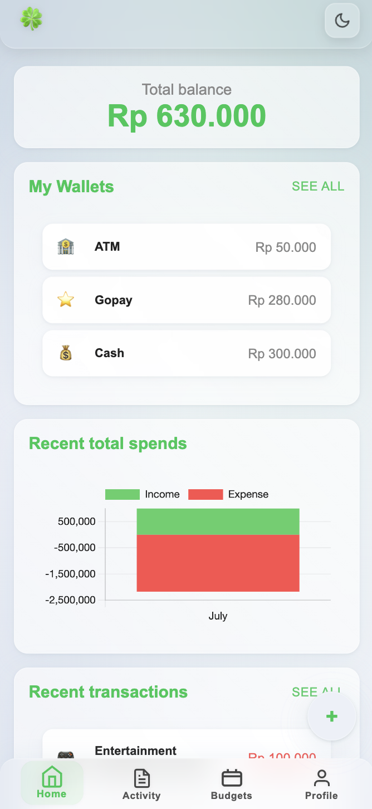

# FORTUNA FLOW
[](https://github.com/Shiyinq/fortuna-flow)


|  |  |  |  |
|:---:|:---:|:---:|:---:|

**Track Your Finances, Unleash Your Fortune**

FortunaFlow is a personal finance management application that empowers you to take control of your money and unlock the path to financial prosperity. By meticulously tracking your income and expenses, you gain valuable insights into your spending habits and uncover opportunities to optimize your financial well-being.

# Table of Contents
- [FORTUNA FLOW](#fortuna-flow)
- [Table of Contents](#table-of-contents)
  - [Features](#features)
  - [Getting Started with Docker](#getting-started-with-docker)
  - [Development](#development)
    - [How to run the backend](#how-to-run-the-backend)
    - [How to run the frontend](#how-to-run-the-frontend)

## Features
* **Comprehensive User Management**
  * Seamlessly register and log in using your preferred method: email, GitHub, or Google.
  * Maintain a comprehensive profile to keep your personal information up-to-date.

* **Robust Wallet Management**
  * Create and manage multiple wallets to effortlessly track various accounts or budgets.
  * Gain a holistic view of your financial standing by consolidating data from all your wallets.

* **Granular Transaction Tracking**
  * Add, update, or delete transactions with ease, ensuring accuracy and completeness.
  * View transactions filtered by wallet or across all wallets for a comprehensive overview.

* **Customizable Transaction Categorization**
  * Create and manage your own transaction categories to tailor the app to your unique needs.
  * Gain insights into your spending patterns by grouping transactions into meaningful categories.

* **Insightful Data Analytics**
  * Access a suite of reports and analytics to gain deeper understanding of your financial data.
  * Identify trends, patterns, and anomalies in your spending to make informed financial decisions.

Embark on a journey toward financial freedom with FortunaFlow as your trusted guide. Let the power of data illuminate your path to a prosperous future.


## Getting Started with Docker

Before you begin, ensure you have [Docker](https://docs.docker.com/engine/install/) installed.

**1. Clone the repository**
```bash
git clone https://github.com/Shiyinq/fortuna-flow.git
cd fortuna-flow
```

**2. Create environment files**

For the backend:
```bash
cp .env.example .env
```

For the frontend:
```bash
cd frontend
cp .env.example .env
cd ..
```

Open each `.env` file you have created and update the values as needed.

**3. Build and run the Docker containers**
```bash
docker compose up --build -d
```
Wait a few minutes for the setup to complete. You can then access:
- Frontend at http://localhost:5000
- Backend at http://localhost:8000

## Development

### How to run the backend

This application is built using Python and MongoDB. To run this application, you will need to have Python and MongoDB installed on your computer.

**1. Clone the Repository**

Clone the application repository from GitHub using the following command:

```
git clone https://github.com/Shiyinq/fortuna-flow.git
```

**2. Create a Virtual Environment (venv)**

Create a virtual environment (venv) using conda with the following command:

```
conda create -n [venv-name] python=3.10
```

Activate the venv with the following command:

```
conda activate [venv-name]
```

**3. Install requirements**

Install the required dependencies with the following command:

```
pip install -r requirements/dev.txt
```

**4. Create the .env File**

Copy the `.env.example` file to the `.env` file.

```
cp .env.example .env
```

**5. Update the .env File**

Update the `.env` file with the following information:

FastAPI

`ORIGINS`: The allowed origins for CORS requests.

`PORT`: The port on which the server will listen for requests.

MongoDB

`MONGODB_URI`: The connection string for the MongoDB database.

`DB_NAME`: The name of the database to use.

JWT

`SECRET_KEY`: The secret key used to sign JWT tokens.

`ALGORITHM`: The algorithm used to sign JWT tokens.

`TOKEN_EXPIRE`: The expiration time for JWT tokens, in seconds.

**6. Run the Server**

Run the server with the following command:

```
sh script/start-dev.sh
```

**7. Open the API Documentation**

The API documentation can be opened in a browser at the following address:

```
http://localhost:8000/docs
```

**Example**

Here is a full example of commands to run the application:

```
git clone https://github.com/Shiyinq/fortuna-flow.git
conda create -n my-app python=3.10
conda activate my-app
cp .env.example .env
vim .env
# Update information on .env
sh script/start-dev.sh
```

After running the above commands, the application will be running on port 8000. You can open the API documentation in a browser at the address http://localhost:8000/docs.

### How to run the frontend
Follow this [README](/frontend/README.md).