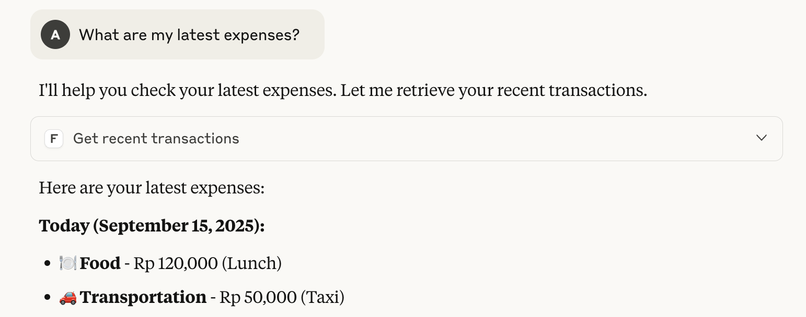

# MCP Server Fortuna Flow



You can integrate Fortuna Flow with Claude Desktop App as an MCP Server.

## Usage
Add the following JSON to your claude MCP config `/your-claude-path/claude_desktop_config.json` file:
```json
{
  "mcpServers": {
    "fortuna-flow": {
      "command": "uv",
      "args": [
        "--directory",
        "/ABSOLUTE/PATH/TO/PARENT/FOLDER/fortuna-flow/mcp-server",
        "run",
        "main.py",
        "--api_base=your-localhost-or-domain-fortuna-flow",
        "--api_key=your-api-key",
        "--log_level=info"
      ]
    }
  }
}
```

Make sure you have `uv` installed on your machine, check with `which uv` for `uv` location, if not exist install with `curl -LsSf https://astral.sh/uv/install.sh | sh`.


for `api_key` you can create one from `Profile -> Settings -> API Key -> Generate API` on Fortuna Flow Frontend.


## Development
Change code in `mcp-server` and for testing you can open `Claude Desktop App` and re open it after you made a changes.

Or you can use [inspector](https://github.com/modelcontextprotocol/inspector) command `npx @modelcontextprotocol/inspector` and connect to this `mcp-server` on inspector web interface.